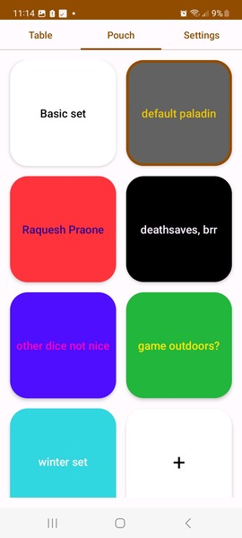
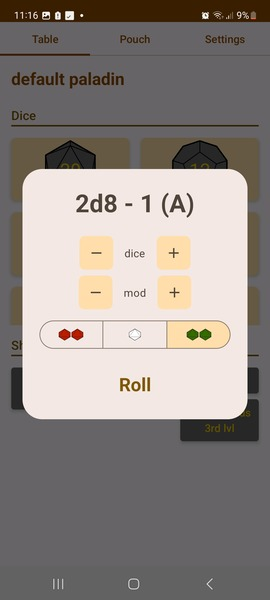

# Dice Pouch
Android app that is a digital pouch for TTRPG dice

### Key features

- customizable dice sets: creating and saving custom dice sets for specific characters, game scenarios, or campaigns, enabling quick access to preferred dice combinations
- comprehensive dice set: creating a wide array of traditional RPG dice (3-100 sides range), including d4, d6, d8, d10, d12, and d20
- advanced rolling options: versatile rolling mechanics, including standard rolls, advantage/disadvantage rolls and modifiers
- shortcuts: creating and saving most common rolling configurations as shortcuts in chosen sets

### Screenshots

